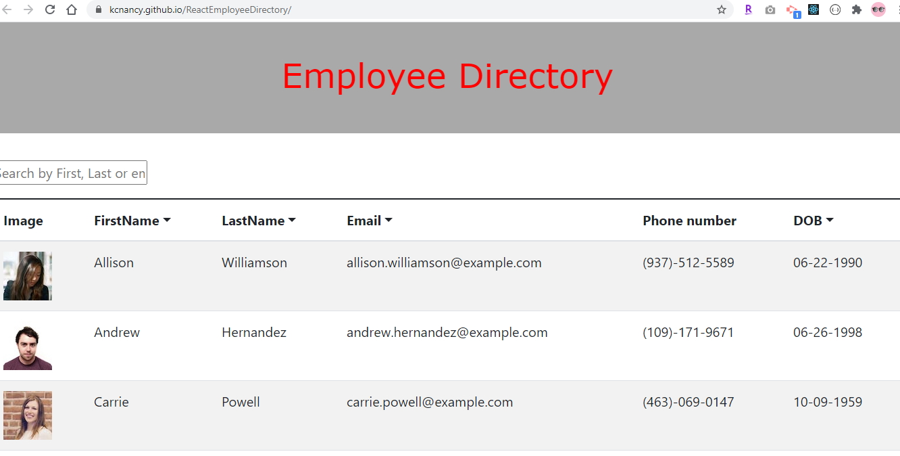

<h1 align="center">Welcome to React Employee Directory 👋</h1>
<p>
  
  <a href="https://github.com/kcnancy/ReactEmployeeDirectory" target="_blank">
    
  </a>
  <a href="#" target="_blank">
    
  </a>
</p>


## Table of Contents
  - [Description](#description)
  - [Homepage](#homepage)
  - [Deployed_App](#Demo)
  - [Installation](#installation)
  - [Usage](#usage)
  - [Author](#author)
  - [Contributions](#contribution)
  - [License](#license)

### Description
> Employee Directory generated with Random Employee API, with the ability to search for a specific name, sort by first name, last name, email address or birthdate.

### 🏠 [Homepage](https://github.com/kcnancy/ReactEmployeeDirectory)

### ✨ [Demo](https://kcnancy.github.io/ReactEmployeeDirectory/)

## Install

```sh
npm install
```

## Usage

```sh
npm run start
```




## Author

👤 **Nancy McBride**

* Website: https://kcnancy.github.io/NancyMcBride-Portfolio/
* Github: [@kcnancy](https://github.com/kcnancy)


***
_This README was generated with ❤️ by [readme-md-generator](https://github.com/kefranabg/readme-md-generator)_